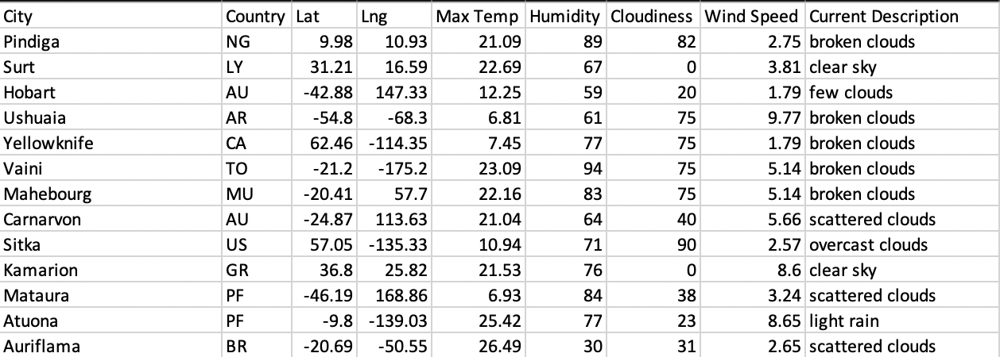
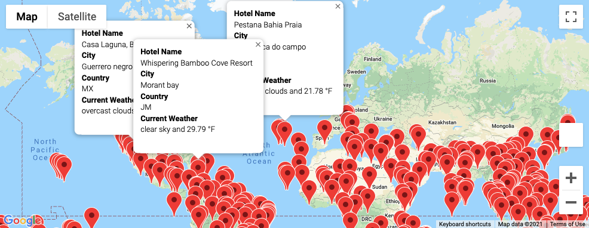
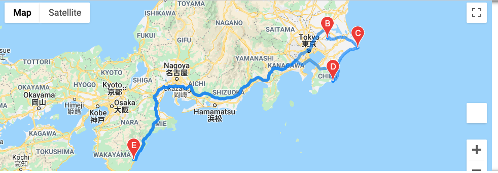

# World_Weather_Analysis
---

Purpose of the repository 

- Weather_Database:
  - The result of the weather database contains 767 rows of locations that include the following columns: City, Country, Lat, Lng, Max Temp, Humidity, Cloudiness, Wind Speed, and Current Description. These  data were generated from the original 2,000 random selected coordinnates (latitudes and longitudes). Raw data were then processed through citipy dependency, and we utilized nearest_city module to choose out the 767 traveling locations. 

- Vacation_Search:
  - With the use of Google Nearby Search API, we were able to identify the hotels near 767 traveling locations. Given the radius of 5000 meters, some of the locations do not have nearby hotels, and these locations are dropped from our final dataset output. The help of Gmaps dependency generated a world map with red pins on all the vacation hotels, along with their information boxes. 

- Vacation_Itinerary:
  - With the chosen 4 hotels where the traveling will take places, Google Gmaps was able to map out the driving route. In our case, we choose to start and end in Shingu UI Hotel. The entire trip will travel through three different hotels: Hotel Twin, Hotel Sunrise Choshi, and Katsuura Hotel Mikazuki.

